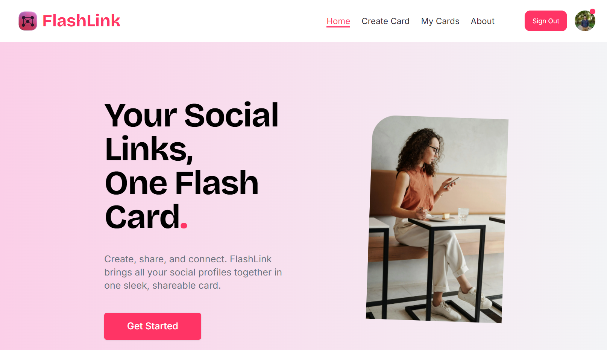

# FlashLink

FlashLink is a web application that allows users to create and share flashcards with their social media URLs. Users can customize their flashcards with attractive backgrounds, add profile photos, and manage multiple social accounts. Each user gets a unique public URL to showcase their flashcards.




## Features

- **User Authentication**: Google Login and Signup.
- **Flashcard Creation**: Users can add multiple social accounts and customize backgrounds and profile photos.
- **Dynamic Public Routes**: Unique URLs for each user (e.g., `/username`).
- **Image Storage**: Cloudinary integration for secure image uploads.
- **Hosting**: Deployed on Vercel for seamless performance.

## Tech Stack

- **Frontend & Backend**: Next.js
- **Database**: MongoDB
- **Image Storage**: Cloudinary
- **Authentication**: Google OAuth

## Installation

1. Clone the repository:
   ```bash
   git clone https://github.com/SwabhimanNanda/flashlink.git
   ```
2. Navigate to the project directory:
   ```bash
   cd flashlink
   ```
3. Install dependencies:
   ```bash
   npm install
   ```
4. Set up environment variables:
   Create a `.env.local` file in the root directory and add:
   ```env
   MONGODB_URI=your-mongodb-connection-string
   CLOUDINARY_KEY=your-cloudinary-key
   CLOUDINARY_API_SECRET=your-cloudinary-api
   CLOUDINARY_CLOUD_NAME=your-cloudinary-name
   GOOGLE_CLIENT_ID=your-google-client-id
   GOOGLE_CLIENT_SECRET=your-google-client-secret
   NEXTAUTH_URL=your-vercel-app-url
   NEXTAUTH_SECRET= your-auth-secret
   GOOGLE_CALLBACK_URL=your-google-client-callback-url
   ```
5. Run the development server:
   ```bash
   npm run dev
   ```

6. Open your browser and go to:
   ```
   http://localhost:3000
   ```

## Features to Add

- Advanced customization for flashcards.
- Analytics to track public flashcard views.
- Integration with additional authentication providers.

## Deployment

The project is hosted on [Vercel](https://vercel.com/). For deployment:
1. Push the code to your GitHub repository.
2. Connect your repository to Vercel.
3. Add environment variables in Vercel settings.
4. Deploy your project.

---

## License

This project is licensed under the [MIT License](LICENSE).

## Contributors

- **Swabhiman** - [swabhiman2025@gmail.com](mailto:swabhiman2025@gmail.com)
